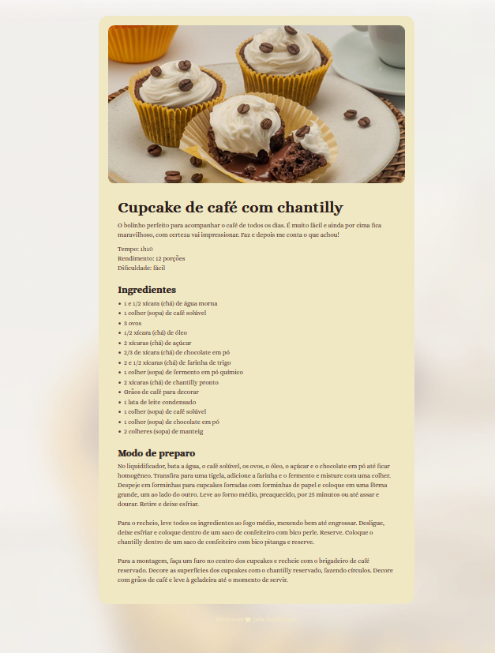

# Cupcake Recipe Page

This project is a simple HTML and CSS webpage that displays a recipe for coffee cupcakes with chantilly. The page includes sections for ingredients, preparation steps, and a final decoration step.

## Project Structure

- `assets/`: Contains images used in the webpage.
- `index.html`: The main HTML file that structures the content of the webpage.
- `style.css`: The CSS file that styles the webpage.

## Screenshots

## How to Run

1. Clone the repository.
2. Open `index.html` in your web browser.

## Features

- Displays a recipe with ingredients and preparation steps.
- Styled with custom fonts and background images.
- Responsive design for different screen sizes.

## Technologies Used

- HTML
- CSS

## License

This project is licensed under the MIT License.
